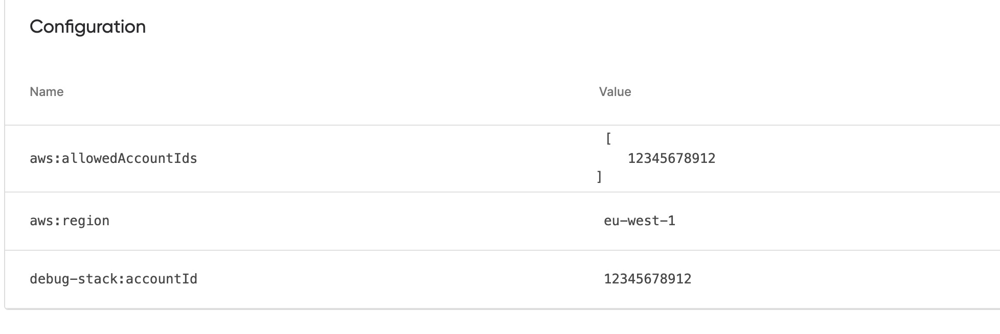

# Type conversion bug repro

To run:

1. `cd debug && npm i && cd ..`
1. `npm i`
1. `npm run start`

Then go view the new stack in the service and instead of `012345678912` you'll see this:

(note missing zero at the front)